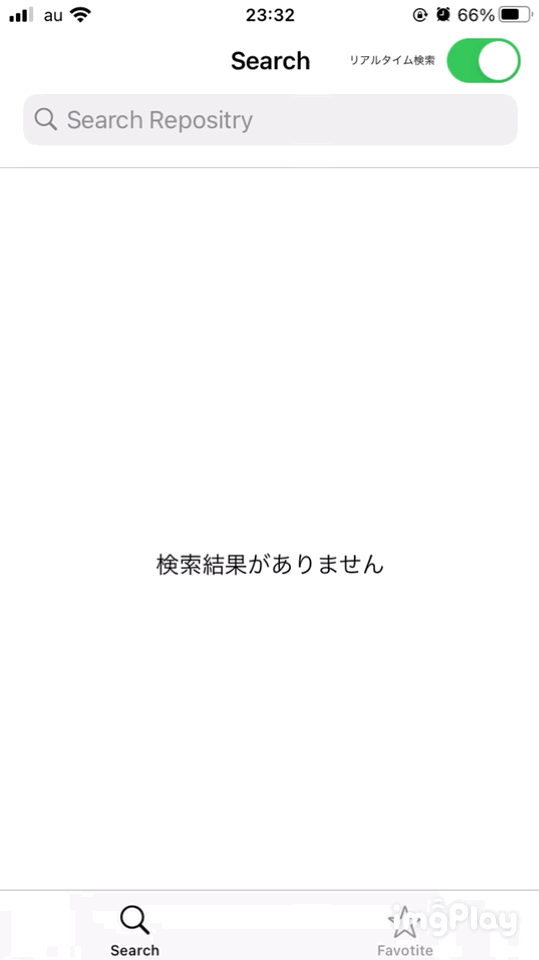

# 設計概要 (iOSEngineerCodeCheck-UIKit)

  

|動作イメージ1|動作イメージ2|
|---|---|
|||

  

<br>

# UI設計


### **ViewController構造**

- ****MainTabBarController**** : <br>RootViewであるTabを構成する為に、UITabBarControllerを継承したVC。ナビゲーションコントローラー生成のHelper Function作成しtabItem 生成の簡略化。UITabBarControllerDelegate,didSelectによりTabItem 選択を検知。

- ****SearchViewController**** :
NavigationbarのUISearchControllerを使用しリポジトリの検索。UItableViewController を継承し作成。rightBarButtonItemにUISwitchを加え検索モードの変更が可能。一度の検索で20件毎getを行い,下部スクロールを行うごとの,ページネーションを実装。

- ****DetailViewController**** :
リポジトリの詳細情報を掲載。Header とFooter二つの子ビューにより構成される。Footer の星形をタップする毎にお気に入りに追加・削除することが出来る。

- ****FavoriteViewController**** :
全お気に入り掲載をUICollectionViewController を継承し作成。上限は20件。タップでDetailVCへの遷移,ロングタップでお気に入り削除アラートが表示され操作を行う。


### **View構造**


- ****SearchResultCell****:
SearchViewControllerにて使用,UITableViewCellを継承.。Repositry propertyを所有し,VCにてSet後,titleLabelを更新。

- ****FavoriteCell****:
FavoriteViewControllerにて使用,UICollectionViewCellを継承.。Favorite propertyを所有し,VCにてSet後,imageview, titlelabelを更新。画像の更新にSDWebImageを使用。


- ****DetailHeaderView & DetailFooterViewl****:
DetailViewControllerにて使用。共にUIViewを継承。View表示後、更新の可能性により分離。後者には,DetailFooterViewProtocolを作成、VCに批准させ。gesture操作を検知。

- ****FavoriteHeaderView****:
FavoriteViewControllerにて使用。collectionView使用の為,UICollectionReusableViewを継承。お気に入り総数を掲載するfavoriteConterLabelを所有。

<br>

# MODEL & API


- ****GitHubSearchResultModel****: 
Codableを批准しJSON型をデータ型にdecodeしています。Repositry構造体にて,falseを初期値とし、変数 favorited定義。

- ****Favorite****:
 Realmにて保存するデータモデル。<br>FavoriteCellにて表示する最低限のカラムをpropertyに持つ。


```swift
/// Realm Data

import RealmSwift

final class Favorite : Object {
    
    @objc dynamic var id = 0
    @objc dynamic var repoId = 0
    
    /// cellに表示する property
    @objc dynamic var title = ""
    @objc dynamic var thumbnailUrl = ""
    
    
    override static func primaryKey() -> String? {
        return "id"
    }
}

```

 

- ****APIService****:
基本的なAPI処理を一任しているクラス。<br>URLSessionを使用しJSON取得後,JSONDecoderを用いparseしています。

  

- ****RealmManager****:
 外部ライブラリ・Realm処理を一任しているクラス。<br>データベースのCRUD処理を纏める事により,処理の複雑化を避ける為に作成。

  

### **ライブラリ**
___

- pod 'SDWebImage'
- pod 'RealmSwift'
- pod 'PKHUD'

### **動作環境**
___

- IDE：Xcode 12.3
- Swift：5.3
- iOS : 14.3

 ___

<div style="text-align: right;">
2020年12月24日<br>
酒井 佑樹
<div>


